# bluetape4k-dependencies

[](https://github.com/bluetape4k/bluetape4k-dependencies/actions/workflows/ci.yml)
[](https://central.sonatype.com/artifact/io.github.bluetape4k/bluetape4k-dependencies)
[](https://kotlinlang.org)
[](https://openjdk.org)
[](LICENSE)

> **Dependency resolution은 BOM으로, Gradle build alias는 catalog로 관리합니다.**


`bluetape4k-dependencies`는 bluetape4k 생태계 전체를 위한 중앙화된 BOM(Bill of Materials)입니다.
`spring-boot-dependencies`와 동일한 패턴을 따릅니다: 플랫폼 의존성 하나만 추가하면 모든 bluetape4k
모듈의 버전이 자동으로 정렬됩니다 — 개별 아티팩트에 버전을 명시할 필요가 없습니다.

같은 레포지토리에서 `bluetape4k-version-catalog`도 함께 배포합니다. 이 Gradle Version Catalog
artifact는 공통 plugin version, library alias, bluetape4k 모듈 좌표를 제공합니다.

영어 버전은 [README.md](README.md)를 참고하세요.

---

## 왜 별도의 BOM 레포지토리가 필요한가?

bluetape4k 생태계는 각자 독립적인 릴리즈 주기를 가진 여러 레포지토리로 분리되어 있습니다:

| 레포지토리 | Group ID |
|---|---|
| [bluetape4k-projects](https://github.com/bluetape4k/bluetape4k-projects) | `io.github.bluetape4k` |
| [bluetape4k-aws](https://github.com/bluetape4k/bluetape4k-aws) | `io.github.bluetape4k.aws` |
| [bluetape4k-image](https://github.com/bluetape4k/bluetape4k-image) | `io.github.bluetape4k.image` |
| [bluetape4k-text](https://github.com/bluetape4k/bluetape4k-text) | `io.github.bluetape4k.text` |
| [bluetape4k-graph](https://github.com/bluetape4k/bluetape4k-graph) | `io.github.bluetape4k.graph` |
| [bluetape4k-leader](https://github.com/bluetape4k/bluetape4k-leader) | `io.github.bluetape4k.leader` |
| [bluetape4k-exposed](https://github.com/bluetape4k/bluetape4k-exposed) | `io.github.bluetape4k.exposed` |
| [bluetape4k-javers](https://github.com/bluetape4k/bluetape4k-javers) | `io.github.bluetape4k.javers` |

중앙화된 BOM과 catalog가 없으면 사용자는 각 레포지토리 버전, Gradle plugin 버전,
compatibility-line alias를 직접 추적해야 합니다. `bluetape4k-dependencies`는 dependency
constraint와 Gradle build alias를 한 곳에 모아 이 문제를 해결합니다.

---

## 구조

```mermaid
graph TD
    BOM["bluetape4k-dependencies<br/>(java-platform BOM)"]
    CATALOG["bluetape4k-version-catalog<br/>(Gradle Version Catalog)"]
    TOML["gradle/libs.versions.toml<br/>(single managed source)"]

    TOML --> BOM
    TOML --> CATALOG

    BOM --> CORE["bluetape4k-projects<br/>io.github.bluetape4k"]
    BOM --> AWS["bluetape4k-aws<br/>io.github.bluetape4k.aws"]
    BOM --> IMAGE["bluetape4k-image<br/>io.github.bluetape4k.image"]
    BOM --> TEXT["bluetape4k-text<br/>io.github.bluetape4k.text"]
    BOM --> GRAPH["bluetape4k-graph<br/>io.github.bluetape4k.graph"]
    BOM --> LEADER["bluetape4k-leader<br/>io.github.bluetape4k.leader"]
    BOM --> EXPOSED["bluetape4k-exposed<br/>io.github.bluetape4k.exposed"]
    BOM --> JAVERS["bluetape4k-javers<br/>io.github.bluetape4k.javers"]

    CORE --> C1["bluetape4k-core"]
    CORE --> C2["bluetape4k-coroutines"]
    CORE --> C3["bluetape4k-logging"]
    CORE --> C4["bluetape4k-jackson2 / jackson3"]
    CORE --> C5["bluetape4k-junit5 / testcontainers"]
    CORE --> C6["... 외 다수"]

    AWS --> A1["aws"]
    AWS --> A2["aws-kotlin"]
    AWS --> A3["aws-spring-boot"]
    AWS --> A4["aws-ktor"]

    IMAGE --> I1["images"]
    IMAGE --> I2["images-vips-api"]
    IMAGE --> I3["images-vips-java21 / java25"]

    TEXT --> T1["tokenizer-core"]
    TEXT --> T2["tokenizer-japanese / korean"]
    TEXT --> T3["lingua"]
    TEXT --> T4["text-search"]

    GRAPH --> G1["graph-core"]
    GRAPH --> G2["graph-age / falkordb / memgraph / neo4j / tinkerpop"]
    GRAPH --> G3["graph-io-core / csv / graphml / jackson2 / jackson3 / okio"]

    LEADER --> L1["leader-core"]
    LEADER --> L2["leader-redis-lettuce / redisson"]
    LEADER --> L3["leader-exposed-core / jdbc / r2dbc"]
    LEADER --> L4["leader-mongodb / hazelcast / zookeeper"]
    LEADER --> L5["leader-spring-boot"]
    LEADER --> L6["leader-micrometer"]
```



---

## 사용 방법

Dependency resolution에는 BOM을 사용합니다. Gradle build alias와 plugin version에는 published Gradle
Version Catalog를 사용합니다. Catalog는 BOM을 대체하지 않습니다. Catalog는 Gradle build가 공유하는
이름 체계를 제공하고, BOM은 실제 resolved dependency version을 정렬합니다.

### Gradle Version Catalog

```kotlin
// settings.gradle.kts
dependencyResolutionManagement {
    repositories {
        mavenCentral()
        maven("https://central.sonatype.com/repository/maven-snapshots/")
    }
    versionCatalogs {
        create("bt4k") {
            from("io.github.bluetape4k:bluetape4k-version-catalog:VERSION")
        }
    }
}
```

```kotlin
// build.gradle.kts
plugins {
    alias(bt4k.plugins.kotlin.jvm)
    alias(bt4k.plugins.nmcp) apply false
}

dependencies {
    implementation(platform("io.github.bluetape4k:bluetape4k-dependencies:VERSION"))
    implementation(bt4k.bluetape4k.core)
    implementation(bt4k.bluetape4k.coroutines)
}
```

BOM을 플랫폼 의존성으로 추가하면 이후 모든 bluetape4k 아티팩트를 **버전 없이** 선언할 수 있습니다.

### Gradle (Kotlin DSL)

```kotlin
dependencies {
    implementation(platform("io.github.bluetape4k:bluetape4k-dependencies:VERSION"))

    // bluetape4k-projects — 핵심 유틸리티
    implementation("io.github.bluetape4k:bluetape4k-core")
    implementation("io.github.bluetape4k:bluetape4k-coroutines")
    implementation("io.github.bluetape4k:bluetape4k-logging")
    implementation("io.github.bluetape4k:bluetape4k-jackson2")
    implementation("io.github.bluetape4k:bluetape4k-jackson3")
    implementation("io.github.bluetape4k:bluetape4k-idgenerators")
    implementation("io.github.bluetape4k:bluetape4k-resilience4j")
    implementation("io.github.bluetape4k:bluetape4k-spring-boot-core")
    testImplementation("io.github.bluetape4k:bluetape4k-junit5")
    testImplementation("io.github.bluetape4k:bluetape4k-testcontainers")

    // bluetape4k-aws
    implementation("io.github.bluetape4k.aws:bluetape4k-aws-java")
    implementation("io.github.bluetape4k.aws:bluetape4k-aws-kotlin")
    implementation("io.github.bluetape4k.aws:bluetape4k-aws-spring-boot")

    // bluetape4k-image
    implementation("io.github.bluetape4k.image:bluetape4k-images")
    implementation("io.github.bluetape4k.image:bluetape4k-images-vips-api")

    // bluetape4k-text
    implementation("io.github.bluetape4k.text:tokenizer-core")
    implementation("io.github.bluetape4k.text:lingua")

    // bluetape4k-graph
    implementation("io.github.bluetape4k.graph:bluetape4k-graph-core")
    implementation("io.github.bluetape4k.graph:bluetape4k-graph-neo4j")

    // bluetape4k-leader
    implementation("io.github.bluetape4k.leader:bluetape4k-leader-core")
    implementation("io.github.bluetape4k.leader:bluetape4k-leader-redis-lettuce")
    implementation("io.github.bluetape4k.leader:bluetape4k-leader-spring-boot")
}
```

### Gradle (Groovy DSL)

```groovy
dependencies {
    implementation platform("io.github.bluetape4k:bluetape4k-dependencies:VERSION")

    implementation "io.github.bluetape4k:bluetape4k-core"
    implementation "io.github.bluetape4k:bluetape4k-coroutines"
    // ... 버전 불필요
}
```

### Maven

```xml
<dependencyManagement>
    <dependencies>
        <dependency>
            <groupId>io.github.bluetape4k</groupId>
            <artifactId>bluetape4k-dependencies</artifactId>
            <version>VERSION</version>
            <type>pom</type>
            <scope>import</scope>
        </dependency>
    </dependencies>
</dependencyManagement>

<dependencies>
    <dependency>
        <groupId>io.github.bluetape4k</groupId>
        <artifactId>bluetape4k-core</artifactId>
        <!-- 버전 불필요 -->
    </dependency>
</dependencies>
```

---

## Spring Boot 정책

`bluetape4k-dependencies`의 첫 공식 배포는 Spring Boot 4-only 통합을
표준으로 삼습니다. Spring Boot 3 아티팩트는 기존 1.7.x 라인에 남아 있지만,
이 BOM의 forward public contract로는 노출하지 않습니다.

Spring Boot 4 통합은 versionless `spring-boot` 아티팩트 이름을 사용합니다:

| 기존 또는 전환 전 이름 | 첫 공식 BOM 표준 이름 |
|---|---|
| `bluetape4k-spring-boot3-*` | 노출하지 않음 |
| `bluetape4k-spring-boot4-*` | `bluetape4k-spring-boot-*` |
| `leader-spring-boot3` / `leader-spring-boot4` | `leader-spring-boot` |
| `bluetape4k-spring-boot4-exposed-*` | `exposed-spring-boot-*` |

---

## 관리 모듈 목록

관리 catalog alias와 BOM constraint는 sibling repository의
`settings.gradle.kts` 모듈 include 목록에서 생성합니다:

```bash
scripts/sync-managed-catalog.py --check --summary
scripts/sync-managed-catalog.py --write --check --summary
python3 -m unittest tests/test_sync_managed_catalog.py
```

bluetape4k 유지보수자를 위한 상세 버전 관리 절차는
[`docs/version-management.ko.md`](docs/version-management.ko.md)를 참고하세요.

정확한 생성 아티팩트 목록, BOM constraint, published Gradle Version Catalog의 기준은
`gradle/libs.versions.toml`입니다.
아래 섹션은 주요 public module family를 요약합니다.

이 레포지토리의 shared dependency/plugin version alias는 sibling 레포지토리의
source of truth이기도 합니다. 해당 alias를 변경한 뒤에는 downstream local catalog를 동기화합니다:

```bash
scripts/sync-shared-versions.py --workspace .. --check --summary
scripts/sync-shared-versions.py --workspace .. --write --check --summary
scripts/sync-dependabot-ignores.py --workspace .. --check --summary
scripts/sync-dependabot-ignores.py --workspace .. --write --check --summary
```

현재 방식은 local catalog를 위한 **materialized sync**입니다.
Published catalog로 완전히 이행하기 전까지
`bluetape4k-dependencies/gradle/libs.versions.toml`이 승인된 버전을 소유하고,
`scripts/sync-shared-versions.py`가 각 대상 레포지토리의 `gradle/libs.versions.toml`에서
같은 alias를 물리적으로 갱신합니다.

Downstream 레포지토리의 Dependabot도 중앙에서 관리하는 dependency name을 ignore해야 합니다.
새 shared dependency line을 추가하면 `scripts/sync-dependabot-ignores.py`의
`CENTRAL_DEPENDENCY_IGNORES`에 dependency name을 추가하고, 위 명령으로
downstream `.github/dependabot.yml`을 동기화합니다.

장기적으로 downstream 레포지토리는 `bluetape4k-version-catalog`를 `bt4k` catalog로
import하고, repository convention plugin을 통해 `bluetape4k-dependencies` BOM을 platform으로
import해야 합니다. BOM은 dependency resolution 계약이고, catalog는 Gradle authoring 계약입니다.

권장 릴리즈 흐름은 다음과 같습니다:

1. 이 레포지토리의 source-of-truth block을 수정합니다.
2. `scripts/sync-shared-versions.py --workspace .. --write --check --summary`를 실행합니다.
3. 중앙 관리 dependency name이 추가/삭제되면
   `scripts/sync-dependabot-ignores.py --workspace .. --write --check --summary`를 실행합니다.
4. 변경된 downstream 레포지토리 PR을 열고 CI 검증 후 머지합니다.
5. 마지막으로 `bluetape4k-dependencies` PR을 머지합니다. 이 PR의 CI는 downstream `develop` branch를
   다시 clone해서 설정된 조직 레포지토리 전체에 shared-version drift가 남아 있는지 검사합니다.

Compatibility-line alias는 의도적으로 분리합니다. 자동 동기화 중 `kafka3`/`kafka4`,
`jackson2`/`jackson3`, `spring-boot3`/`spring-boot4`, `spring-kafka`/`spring-kafka4` 같은 alias를
하나로 합치지 않습니다.

### bluetape4k-projects (`io.github.bluetape4k`)

아래 표는 현재 `gradle/libs.versions.toml`에 생성되는 모든 managed `bluetape4k-projects` artifact를
기록합니다.

| 아티팩트 | 영역 |
|---|---|
| `bluetape4k-assertions` | 테스트 assertion |
| `bluetape4k-avro` | 직렬화 |
| `bluetape4k-bom` | BOM |
| `bluetape4k-bucket4j` | Rate limiting |
| `bluetape4k-cache-core` | Cache |
| `bluetape4k-cache-hazelcast` | Cache |
| `bluetape4k-cache-lettuce` | Cache |
| `bluetape4k-cache-redisson` | Cache |
| `bluetape4k-cassandra` | Data access |
| `bluetape4k-core` | 핵심 유틸리티 |
| `bluetape4k-coroutines` | Coroutines |
| `bluetape4k-csv` | 직렬화 |
| `bluetape4k-elasticsearch` | Search |
| `bluetape4k-fastjson2` | 직렬화 |
| `bluetape4k-feign` | HTTP client |
| `bluetape4k-geo` | Geo 유틸리티 |
| `bluetape4k-grpc` | gRPC |
| `bluetape4k-hibernate` | Hibernate |
| `bluetape4k-hibernate-cache-lettuce` | Hibernate cache |
| `bluetape4k-hibernate-reactive` | Hibernate Reactive |
| `bluetape4k-http` | HTTP |
| `bluetape4k-idgenerators` | ID 생성 |
| `bluetape4k-io` | I/O |
| `bluetape4k-jackson2` | Jackson 2 |
| `bluetape4k-jackson3` | Jackson 3 |
| `bluetape4k-javatimes` | 날짜/시간 |
| `bluetape4k-jdbc` | JDBC |
| `bluetape4k-json` | JSON |
| `bluetape4k-junit5` | JUnit 5 |
| `bluetape4k-jwt` | JWT |
| `bluetape4k-kafka` | Kafka 3 line |
| `bluetape4k-kafka-logback` | Kafka logging |
| `bluetape4k-kafka4` | Kafka 4 line |
| `bluetape4k-lettuce` | Redis Lettuce |
| `bluetape4k-logging` | Logging |
| `bluetape4k-math` | Math |
| `bluetape4k-measured` | Measurement |
| `bluetape4k-micrometer` | Metrics |
| `bluetape4k-mock-web-server` | Testing |
| `bluetape4k-mock-webflux-server` | Testing |
| `bluetape4k-money` | Money |
| `bluetape4k-mongodb` | MongoDB |
| `bluetape4k-mutiny` | Mutiny |
| `bluetape4k-nats` | NATS |
| `bluetape4k-netty` | Netty |
| `bluetape4k-okio` | Okio |
| `bluetape4k-opentelemetry` | OpenTelemetry |
| `bluetape4k-probabilistic` | 확률적 자료구조 |
| `bluetape4k-protobuf` | Protobuf |
| `bluetape4k-pulsar` | Pulsar |
| `bluetape4k-r2dbc` | R2DBC |
| `bluetape4k-redis` | Redis |
| `bluetape4k-redisson` | Redis Redisson |
| `bluetape4k-resilience4j` | Resilience4j |
| `bluetape4k-retrofit2` | HTTP client |
| `bluetape4k-rule-engine` | Rules |
| `bluetape4k-science` | Science 유틸리티 |
| `bluetape4k-spring-boot-cassandra` | Spring Boot |
| `bluetape4k-spring-boot-core` | Spring Boot |
| `bluetape4k-spring-boot-hibernate-lettuce` | Spring Boot |
| `bluetape4k-spring-boot-mongodb` | Spring Boot |
| `bluetape4k-spring-boot-r2dbc` | Spring Boot |
| `bluetape4k-spring-boot-redis` | Spring Boot |
| `bluetape4k-states` | State machine |
| `bluetape4k-testcontainers` | Testcontainers |
| `bluetape4k-tink` | Tink crypto |
| `bluetape4k-vertx` | Vert.x |
| `bluetape4k-virtualthread-api` | Virtual threads |
| `bluetape4k-virtualthread-jdk21` | Virtual threads |
| `bluetape4k-virtualthread-jdk25` | Virtual threads |
| `bluetape4k-workflow` | Workflow 유틸리티 |

### bluetape4k-aws (`io.github.bluetape4k.aws`)

| 아티팩트 | 설명 |
|---|---|
| `aws` | AWS SDK v2 Kotlin 확장 |
| `aws-kotlin` | AWS Kotlin SDK 지원 |
| `aws-spring-boot` | AWS용 Spring Boot 자동 설정 |
| `aws-ktor` | AWS용 Ktor 통합 |

### bluetape4k-image (`io.github.bluetape4k.image`)

| 아티팩트 | 설명 |
|---|---|
| `images` | 이미지 처리 핵심 유틸리티 |
| `images-vips-api` | libvips API 추상화 |
| `images-vips-java21` | Java 21용 libvips 바인딩 |
| `images-vips-java25` | Java 25용 libvips 바인딩 |

### bluetape4k-text (`io.github.bluetape4k.text`)

| 아티팩트 | 설명 |
|---|---|
| `tokenizer-core` | 텍스트 토크나이저 핵심 API |
| `tokenizer-japanese` | 일본어 토크나이저 (Kuromoji) |
| `tokenizer-korean` | 한국어 토크나이저 (Nori / Komoran) |
| `lingua` | 언어 감지 (Lingua) |
| `text-search` | 전문 검색 유틸리티 |

### bluetape4k-graph (`io.github.bluetape4k.graph`)

| 아티팩트 | 설명 |
|---|---|
| `bluetape4k-graph-bom` | 그래프 모듈 BOM |
| `graph-core` | 핵심 그래프 추상화 |
| `graph-age` | Apache AGE (PostgreSQL 그래프) 통합 |
| `graph-falkordb` | FalkorDB 통합 |
| `graph-memgraph` | Memgraph 통합 |
| `graph-neo4j` | Neo4j 통합 |
| `graph-tinkerpop` | Apache TinkerPop 통합 |
| `graph-io-core` | 그래프 I/O 핵심 |
| `graph-io-csv` | CSV 그래프 직렬화 |
| `graph-io-graphml` | GraphML 직렬화 |
| `graph-io-jackson2` | Jackson 2.x 그래프 직렬화 |
| `graph-io-jackson3` | Jackson 3.x 그래프 직렬화 |
| `graph-okio` | Okio 기반 그래프 I/O |

### bluetape4k-leader (`io.github.bluetape4k.leader`)

| 아티팩트 | 설명 |
|---|---|
| `leader-bom` | 리더 선출 모듈 BOM |
| `leader-core` | 핵심 리더 선출 API |
| `leader-redis-lettuce` | Lettuce 기반 Redis 리더 선출 |
| `leader-redis-redisson` | Redisson 기반 Redis 리더 선출 |
| `leader-exposed-core` | Exposed 리더 선출 공통 |
| `leader-exposed-jdbc` | Exposed JDBC 리더 선출 |
| `leader-exposed-r2dbc` | Exposed R2DBC 리더 선출 |
| `leader-mongodb` | MongoDB 리더 선출 |
| `leader-hazelcast` | Hazelcast 리더 선출 |
| `leader-zookeeper` | ZooKeeper/Apache Curator 리더 선출 |
| `leader-spring-boot` | Spring Boot 4 자동 설정과 AOP |
| `leader-ktor` | 리더 선출 Ktor 통합 |
| `leader-micrometer` | 리더 선출 Micrometer 메트릭 |

---

## 버전 관리 정책

각 업스트림 레포지토리는 **독립적인 버전**을 유지하며 `gradle/libs.versions.toml`에서 관리됩니다:

```toml
[versions]
bluetape4k-core   = "1.8.0-SNAPSHOT"
bluetape4k-aws    = "0.1.0-SNAPSHOT"
bluetape4k-image  = "0.1.0-SNAPSHOT"
bluetape4k-text   = "0.1.0-SNAPSHOT"
bluetape4k-graph  = "0.3.0-SNAPSHOT"
bluetape4k-leader = "0.1.0-SNAPSHOT"
bluetape4k-exposed = "1.8.0-SNAPSHOT"
bluetape4k-javers = "0.1.0-SNAPSHOT"
```

새로운 업스트림 릴리즈를 반영하려면 `libs.versions.toml`에서 해당 버전을 수정하고 새 BOM 버전을 배포하면 됩니다.

---

## 라이선스

[MIT License](LICENSE) 라이선스를 따릅니다.
