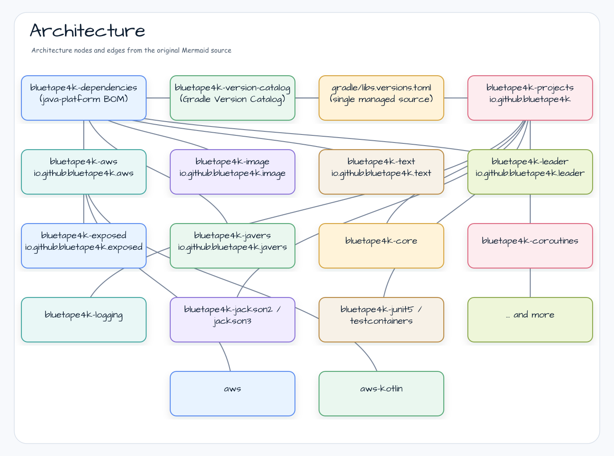

# bluetape4k-dependencies

[](https://github.com/bluetape4k/bluetape4k-dependencies/actions/workflows/ci.yml)
[](https://central.sonatype.com/artifact/io.github.bluetape4k/bluetape4k-dependencies)
[](https://kotlinlang.org)
[](https://openjdk.org)
[](LICENSE)

> **One BOM for dependency resolution, one Gradle catalog for build aliases.**


`bluetape4k-dependencies` is the centralized Bill of Materials (BOM) for the entire bluetape4k ecosystem.
It follows the same pattern as `spring-boot-dependencies`: import one platform dependency and all bluetape4k
module versions are aligned automatically — no per-artifact version declarations needed.

The same repository also publishes `bluetape4k-version-catalog`, a Gradle Version Catalog artifact for
shared plugin versions, library aliases, and bluetape4k module coordinates.

Also available in [Korean / 한국어](README.ko.md).

---

## Why a Separate BOM Repository?

The bluetape4k ecosystem is split across multiple independent repositories, each with its own release cadence:

| Repository | Group ID |
|---|---|
| [bluetape4k-projects](https://github.com/bluetape4k/bluetape4k-projects) | `io.github.bluetape4k` |
| [bluetape4k-aws](https://github.com/bluetape4k/bluetape4k-aws) | `io.github.bluetape4k.aws` |
| [bluetape4k-image](https://github.com/bluetape4k/bluetape4k-image) | `io.github.bluetape4k.image` |
| [bluetape4k-text](https://github.com/bluetape4k/bluetape4k-text) | `io.github.bluetape4k.text` |
| [bluetape4k-graph](https://github.com/bluetape4k/bluetape4k-graph) | `io.github.bluetape4k.graph` |
| [bluetape4k-leader](https://github.com/bluetape4k/bluetape4k-leader) | `io.github.bluetape4k.leader` |
| [bluetape4k-exposed](https://github.com/bluetape4k/bluetape4k-exposed) | `io.github.bluetape4k.exposed` |
| [bluetape4k-javers](https://github.com/bluetape4k/bluetape4k-javers) | `io.github.bluetape4k.javers` |

Without a central BOM and catalog, consumers must track every repository version, Gradle plugin version, and
compatibility-line alias independently. `bluetape4k-dependencies` solves this by collecting dependency
constraints and Gradle build aliases in one place.

---

## Architecture



---

## Usage

Use the BOM for dependency resolution. Use the published Gradle Version Catalog for build aliases and plugin
versions. The catalog does not replace the BOM; it gives Gradle builds a shared vocabulary while the BOM
aligns resolved dependency versions.

### Gradle Version Catalog

```kotlin
// settings.gradle.kts
dependencyResolutionManagement {
    repositories {
        mavenCentral()
        maven("https://central.sonatype.com/repository/maven-snapshots/")
    }
    versionCatalogs {
        create("bt4k") {
            from("io.github.bluetape4k:bluetape4k-version-catalog:VERSION")
        }
    }
}
```

```kotlin
// build.gradle.kts
plugins {
    alias(bt4k.plugins.kotlin.jvm)
    alias(bt4k.plugins.nmcp) apply false
}

dependencies {
    implementation(platform("io.github.bluetape4k:bluetape4k-dependencies:VERSION"))
    implementation(bt4k.bluetape4k.core)
    implementation(bt4k.bluetape4k.coroutines)
}
```

Add the BOM as a platform dependency. After that, all bluetape4k artifacts can be declared **without a version**.

### Gradle (Kotlin DSL)

```kotlin
dependencies {
    implementation(platform("io.github.bluetape4k:bluetape4k-dependencies:VERSION"))

    // bluetape4k-projects — core utilities
    implementation("io.github.bluetape4k:bluetape4k-core")
    implementation("io.github.bluetape4k:bluetape4k-coroutines")
    implementation("io.github.bluetape4k:bluetape4k-logging")
    implementation("io.github.bluetape4k:bluetape4k-jackson2")
    implementation("io.github.bluetape4k:bluetape4k-jackson3")
    implementation("io.github.bluetape4k:bluetape4k-idgenerators")
    implementation("io.github.bluetape4k:bluetape4k-resilience4j")
    implementation("io.github.bluetape4k:bluetape4k-spring-boot-core")
    testImplementation("io.github.bluetape4k:bluetape4k-junit5")
    testImplementation("io.github.bluetape4k:bluetape4k-testcontainers")

    // bluetape4k-aws
    implementation("io.github.bluetape4k.aws:bluetape4k-aws-java")
    implementation("io.github.bluetape4k.aws:bluetape4k-aws-kotlin")
    implementation("io.github.bluetape4k.aws:bluetape4k-aws-spring-boot")

    // bluetape4k-image
    implementation("io.github.bluetape4k.image:bluetape4k-images")
    implementation("io.github.bluetape4k.image:bluetape4k-images-vips-api")

    // bluetape4k-text
    implementation("io.github.bluetape4k.text:tokenizer-core")
    implementation("io.github.bluetape4k.text:lingua")

    // bluetape4k-graph
    implementation("io.github.bluetape4k.graph:bluetape4k-graph-core")
    implementation("io.github.bluetape4k.graph:bluetape4k-graph-neo4j")

    // bluetape4k-leader
    implementation("io.github.bluetape4k.leader:bluetape4k-leader-core")
    implementation("io.github.bluetape4k.leader:bluetape4k-leader-redis-lettuce")
    implementation("io.github.bluetape4k.leader:bluetape4k-leader-spring-boot")
}
```

### Gradle (Groovy DSL)

```groovy
dependencies {
    implementation platform("io.github.bluetape4k:bluetape4k-dependencies:VERSION")

    implementation "io.github.bluetape4k:bluetape4k-core"
    implementation "io.github.bluetape4k:bluetape4k-coroutines"
    // ... no version needed
}
```

### Maven

```xml
<dependencyManagement>
    <dependencies>
        <dependency>
            <groupId>io.github.bluetape4k</groupId>
            <artifactId>bluetape4k-dependencies</artifactId>
            <version>VERSION</version>
            <type>pom</type>
            <scope>import</scope>
        </dependency>
    </dependencies>
</dependencyManagement>

<dependencies>
    <dependency>
        <groupId>io.github.bluetape4k</groupId>
        <artifactId>bluetape4k-core</artifactId>
        <!-- no version needed -->
    </dependency>
</dependencies>
```

---

## Spring Boot Policy

The first official `bluetape4k-dependencies` release standardizes on Spring
Boot 4-only integrations. Spring Boot 3 artifacts remain available from the
older 1.7.x line, but they are not exposed by this BOM as the forward public
contract.

Use versionless `spring-boot` artifact names for Spring Boot 4 integrations:

| Older or transitional name | First official BOM name |
|---|---|
| `bluetape4k-spring-boot3-*` | Not exposed |
| `bluetape4k-spring-boot4-*` | `bluetape4k-spring-boot-*` |
| `leader-spring-boot3` / `leader-spring-boot4` | `leader-spring-boot` |
| `bluetape4k-spring-boot4-exposed-*` | `exposed-spring-boot-*` |

---

## Managed Modules

Managed catalog aliases and BOM constraints are generated from sibling
repository `settings.gradle.kts` module includes:

```bash
scripts/sync-managed-catalog.py --check --summary
scripts/sync-managed-catalog.py --write --check --summary
python3 -m unittest tests/test_sync_managed_catalog.py
```

For the Korean operating procedure used by the bluetape4k maintainers, see
[`docs/version-management.ko.md`](docs/version-management.ko.md).

`gradle/libs.versions.toml` is the source of truth for the exact generated
artifact list, BOM constraints, and published Gradle Version Catalog. The sections below summarize the main
public module families.

Shared dependency and plugin version aliases in this repository are also the source of truth for sibling
repositories. Sync downstream local catalogs after changing those aliases:

```bash
scripts/sync-shared-versions.py --workspace .. --check --summary
scripts/sync-shared-versions.py --workspace .. --write --check --summary
scripts/sync-dependabot-ignores.py --workspace .. --check --summary
scripts/sync-dependabot-ignores.py --workspace .. --write --check --summary
scripts/triage-dependabot-alerts.py --repo bluetape4k-projects
```

This is currently a **materialized sync** workflow for local catalogs. During
the migration to the published catalog, `bluetape4k-dependencies/gradle/libs.versions.toml`
owns the approved versions, and `scripts/sync-shared-versions.py` rewrites the matching
aliases in each target repository's `gradle/libs.versions.toml`.

Downstream repositories also ignore centrally governed dependency names in
Dependabot. Add new central dependency names to `CENTRAL_DEPENDENCY_IGNORES` in
`scripts/sync-dependabot-ignores.py`, then sync downstream `.github/dependabot.yml`
files with the command above.

Dependabot security alerts are triaged by ownership, not by the repository that
displays the alert. Use `scripts/triage-dependabot-alerts.py` to classify open
alerts as:

| Route | Owner | Action |
|---|---|---|
| `central-catalog` | `bluetape4k-dependencies` | Update the source-of-truth catalog first, then sync downstream repositories. |
| `central-bom-transitive` | Central BOM line such as `spring-boot` | Move the BOM line when a patched BOM exists; otherwise add or keep a central override and sync downstream. |
| `repo-tooling` | Alert repository | Fix local Gradle/plugin/settings tooling unless the package is promoted to central governance. |
| `repo-local` | Alert repository | Fix the repository-owned dependency directly. |

Long-term, downstream repositories should import `bluetape4k-version-catalog`
as a `bt4k` catalog and import `bluetape4k-dependencies` as a platform through
their repository convention plugin. The BOM remains the dependency-resolution
contract; the catalog remains the Gradle authoring contract.

The expected release flow is:

1. Update the source-of-truth block in this repository.
2. Run `scripts/sync-shared-versions.py --workspace .. --write --check --summary`.
3. Run `scripts/sync-dependabot-ignores.py --workspace .. --write --check --summary`
   when the change adds or removes centrally governed dependency names.
4. Open, verify, and merge PRs for the downstream repositories that changed.
5. Merge the `bluetape4k-dependencies` PR last, where CI re-clones downstream `develop` branches and checks
   that no shared-version drift remains across the configured organization repositories.

Compatibility-line aliases are intentionally separate. Do not collapse aliases such as `kafka3`/`kafka4`,
`jackson2`/`jackson3`, `spring-boot3`/`spring-boot4`, or `spring-kafka`/`spring-kafka4` during automated
version sync.

### bluetape4k-projects (`io.github.bluetape4k`)

The table below lists every managed `bluetape4k-projects` artifact currently generated into
`gradle/libs.versions.toml`.

| Artifact | Area |
|---|---|
| `bluetape4k-assertions` | Test assertions |
| `bluetape4k-avro` | Serialization |
| `bluetape4k-bom` | BOM |
| `bluetape4k-bucket4j` | Rate limiting |
| `bluetape4k-cache-core` | Cache |
| `bluetape4k-cache-hazelcast` | Cache |
| `bluetape4k-cache-lettuce` | Cache |
| `bluetape4k-cache-redisson` | Cache |
| `bluetape4k-cassandra` | Data access |
| `bluetape4k-core` | Core utilities |
| `bluetape4k-coroutines` | Coroutines |
| `bluetape4k-csv` | Serialization |
| `bluetape4k-elasticsearch` | Search |
| `bluetape4k-fastjson2` | Serialization |
| `bluetape4k-feign` | HTTP client |
| `bluetape4k-geo` | Geo utilities |
| `bluetape4k-grpc` | gRPC |
| `bluetape4k-hibernate` | Hibernate |
| `bluetape4k-hibernate-cache-lettuce` | Hibernate cache |
| `bluetape4k-hibernate-reactive` | Hibernate Reactive |
| `bluetape4k-http` | HTTP |
| `bluetape4k-idgenerators` | ID generation |
| `bluetape4k-io` | I/O |
| `bluetape4k-jackson2` | Jackson 2 |
| `bluetape4k-jackson3` | Jackson 3 |
| `bluetape4k-javatimes` | Date/time |
| `bluetape4k-jdbc` | JDBC |
| `bluetape4k-json` | JSON |
| `bluetape4k-junit5` | JUnit 5 |
| `bluetape4k-jwt` | JWT |
| `bluetape4k-kafka` | Kafka 3 line |
| `bluetape4k-kafka-logback` | Kafka logging |
| `bluetape4k-kafka4` | Kafka 4 line |
| `bluetape4k-lettuce` | Redis Lettuce |
| `bluetape4k-logging` | Logging |
| `bluetape4k-math` | Math |
| `bluetape4k-measured` | Measurement |
| `bluetape4k-micrometer` | Metrics |
| `bluetape4k-mock-web-server` | Testing |
| `bluetape4k-mock-webflux-server` | Testing |
| `bluetape4k-money` | Money |
| `bluetape4k-mongodb` | MongoDB |
| `bluetape4k-mutiny` | Mutiny |
| `bluetape4k-nats` | NATS |
| `bluetape4k-netty` | Netty |
| `bluetape4k-okio` | Okio |
| `bluetape4k-opentelemetry` | OpenTelemetry |
| `bluetape4k-probabilistic` | Probabilistic data structures |
| `bluetape4k-protobuf` | Protobuf |
| `bluetape4k-pulsar` | Pulsar |
| `bluetape4k-r2dbc` | R2DBC |
| `bluetape4k-redis` | Redis |
| `bluetape4k-redisson` | Redis Redisson |
| `bluetape4k-resilience4j` | Resilience4j |
| `bluetape4k-retrofit2` | HTTP client |
| `bluetape4k-rule-engine` | Rules |
| `bluetape4k-science` | Science utilities |
| `bluetape4k-spring-boot-cassandra` | Spring Boot |
| `bluetape4k-spring-boot-core` | Spring Boot |
| `bluetape4k-spring-boot-hibernate-lettuce` | Spring Boot |
| `bluetape4k-spring-boot-mongodb` | Spring Boot |
| `bluetape4k-spring-boot-r2dbc` | Spring Boot |
| `bluetape4k-spring-boot-redis` | Spring Boot |
| `bluetape4k-states` | State machines |
| `bluetape4k-testcontainers` | Testcontainers |
| `bluetape4k-tink` | Tink crypto |
| `bluetape4k-vertx` | Vert.x |
| `bluetape4k-virtualthread-api` | Virtual threads |
| `bluetape4k-virtualthread-jdk21` | Virtual threads |
| `bluetape4k-virtualthread-jdk25` | Virtual threads |
| `bluetape4k-workflow` | Workflow utilities |

### bluetape4k-aws (`io.github.bluetape4k.aws`)

| Artifact | Description |
|---|---|
| `aws` | AWS SDK v2 Kotlin extensions |
| `aws-kotlin` | AWS Kotlin SDK support |
| `aws-spring-boot` | Spring Boot auto-configuration for AWS |
| `aws-ktor` | Ktor integration for AWS |

### bluetape4k-image (`io.github.bluetape4k.image`)

| Artifact | Description |
|---|---|
| `images` | Core image processing utilities |
| `images-vips-api` | libvips API abstraction |
| `images-vips-java21` | libvips bindings for Java 21 |
| `images-vips-java25` | libvips bindings for Java 25 |

### bluetape4k-text (`io.github.bluetape4k.text`)

| Artifact | Description |
|---|---|
| `tokenizer-core` | Text tokenizer core API |
| `tokenizer-japanese` | Japanese tokenizer (Kuromoji) |
| `tokenizer-korean` | Korean tokenizer (Nori / Komoran) |
| `lingua` | Language detection (Lingua) |
| `text-search` | Full-text search utilities |

### bluetape4k-graph (`io.github.bluetape4k.graph`)

| Artifact | Description |
|---|---|
| `bluetape4k-graph-bom` | Graph module BOM |
| `graph-core` | Core graph abstractions |
| `graph-age` | Apache AGE (PostgreSQL graph) integration |
| `graph-falkordb` | FalkorDB integration |
| `graph-memgraph` | Memgraph integration |
| `graph-neo4j` | Neo4j integration |
| `graph-tinkerpop` | Apache TinkerPop integration |
| `graph-io-core` | Graph I/O core |
| `graph-io-csv` | CSV graph serialization |
| `graph-io-graphml` | GraphML serialization |
| `graph-io-jackson2` | Jackson 2.x graph serialization |
| `graph-io-jackson3` | Jackson 3.x graph serialization |
| `graph-okio` | Okio-based graph I/O |

### bluetape4k-leader (`io.github.bluetape4k.leader`)

| Artifact | Description |
|---|---|
| `leader-bom` | Leader election module BOM |
| `leader-core` | Core leader election API |
| `leader-redis-lettuce` | Redis leader election via Lettuce |
| `leader-redis-redisson` | Redis leader election via Redisson |
| `leader-exposed-core` | Exposed (JDBC/R2DBC) leader election core |
| `leader-exposed-jdbc` | Exposed JDBC leader election |
| `leader-exposed-r2dbc` | Exposed R2DBC leader election |
| `leader-mongodb` | MongoDB leader election |
| `leader-hazelcast` | Hazelcast leader election |
| `leader-zookeeper` | ZooKeeper/Apache Curator leader election |
| `leader-spring-boot` | Spring Boot 4 auto-configuration and AOP |
| `leader-ktor` | Ktor integration for leader election |
| `leader-micrometer` | Micrometer metrics for leader election |

---

## Versioning

Each upstream repository maintains its **own independent version**, tracked in `gradle/libs.versions.toml`:

```toml
[versions]
bluetape4k-core   = "1.8.0"
bluetape4k-aws    = "0.1.0"
bluetape4k-image  = "0.1.0"
bluetape4k-text   = "0.1.0"
bluetape4k-graph  = "0.3.0"
bluetape4k-leader = "0.1.0"
bluetape4k-exposed = "1.8.1-SNAPSHOT"
bluetape4k-javers = "0.1.0"
```

To align a new upstream release, edit the version in `libs.versions.toml` and publish a new BOM version.

---

## License

Licensed under the [MIT License](LICENSE).
