# bluetape4k-dependencies

[](https://github.com/bluetape4k/bluetape4k-dependencies/actions/workflows/ci.yml)
[](https://central.sonatype.com/artifact/io.github.bluetape4k/bluetape4k-dependencies)
[](https://kotlinlang.org)
[](https://openjdk.org)
[](LICENSE)

> **Single BOM to rule all bluetape4k modules.**

`bluetape4k-dependencies` is the centralized Bill of Materials (BOM) for the entire bluetape4k ecosystem.
It follows the same pattern as `spring-boot-dependencies`: import one platform dependency and all bluetape4k
module versions are aligned automatically — no per-artifact version declarations needed.

Also available in [Korean / 한국어](README.ko.md).

---

## Why a Separate BOM Repository?

The bluetape4k ecosystem is split across multiple independent repositories, each with its own release cadence:

| Repository | Group ID |
|---|---|
| [bluetape4k-projects](https://github.com/bluetape4k/bluetape4k-projects) | `io.github.bluetape4k` |
| [bluetape4k-aws](https://github.com/bluetape4k/bluetape4k-aws) | `io.github.bluetape4k.aws` |
| [bluetape4k-image](https://github.com/bluetape4k/bluetape4k-image) | `io.github.bluetape4k.image` |
| [bluetape4k-text](https://github.com/bluetape4k/bluetape4k-text) | `io.github.bluetape4k.text` |
| [bluetape4k-graph](https://github.com/bluetape4k/bluetape4k-graph) | `io.github.bluetape4k.graph` |
| [bluetape4k-leader](https://github.com/bluetape4k/bluetape4k-leader) | `io.github.bluetape4k.leader` |

Without a central BOM, consumers must track every repository's version independently.
`bluetape4k-dependencies` solves this by collecting all version constraints in one place.

---

## Architecture

```mermaid
graph TD
    BOM["bluetape4k-dependencies<br/>(java-platform BOM)"]

    BOM --> CORE["bluetape4k-projects<br/>io.github.bluetape4k"]
    BOM --> AWS["bluetape4k-aws<br/>io.github.bluetape4k.aws"]
    BOM --> IMAGE["bluetape4k-image<br/>io.github.bluetape4k.image"]
    BOM --> TEXT["bluetape4k-text<br/>io.github.bluetape4k.text"]
    BOM --> GRAPH["bluetape4k-graph<br/>io.github.bluetape4k.graph"]
    BOM --> LEADER["bluetape4k-leader<br/>io.github.bluetape4k.leader"]

    CORE --> C1["bluetape4k-core"]
    CORE --> C2["bluetape4k-coroutines"]
    CORE --> C3["bluetape4k-logging"]
    CORE --> C4["bluetape4k-jackson2 / jackson3"]
    CORE --> C5["bluetape4k-junit5 / testcontainers"]
    CORE --> C6["... and more"]

    AWS --> A1["aws"]
    AWS --> A2["aws-kotlin"]
    AWS --> A3["aws-spring-boot"]
    AWS --> A4["aws-ktor"]

    IMAGE --> I1["images"]
    IMAGE --> I2["images-vips-api"]
    IMAGE --> I3["images-vips-java21 / java25"]

    TEXT --> T1["tokenizer-core"]
    TEXT --> T2["tokenizer-japanese / korean"]
    TEXT --> T3["lingua"]
    TEXT --> T4["text-search"]

    GRAPH --> G1["graph-core"]
    GRAPH --> G2["graph-age / falkordb / memgraph / neo4j / tinkerpop"]
    GRAPH --> G3["graph-io-core / csv / graphml / jackson2 / jackson3 / okio"]

    LEADER --> L1["leader-core"]
    LEADER --> L2["leader-redis-lettuce / redisson"]
    LEADER --> L3["leader-exposed-core / jdbc / r2dbc"]
    LEADER --> L4["leader-mongodb / hazelcast / zookeeper"]
    LEADER --> L5["leader-spring-boot-common / boot3 / boot4"]
    LEADER --> L6["leader-micrometer"]
```



---

## Usage

Add the BOM as a platform dependency. After that, all bluetape4k artifacts can be declared **without a version**.

### Gradle (Kotlin DSL)

```kotlin
dependencies {
    implementation(platform("io.github.bluetape4k:bluetape4k-dependencies:VERSION"))

    // bluetape4k-projects — core utilities
    implementation("io.github.bluetape4k:bluetape4k-core")
    implementation("io.github.bluetape4k:bluetape4k-coroutines")
    implementation("io.github.bluetape4k:bluetape4k-logging")
    implementation("io.github.bluetape4k:bluetape4k-jackson2")
    implementation("io.github.bluetape4k:bluetape4k-jackson3")
    implementation("io.github.bluetape4k:bluetape4k-idgenerators")
    implementation("io.github.bluetape4k:bluetape4k-resilience4j")
    testImplementation("io.github.bluetape4k:bluetape4k-junit5")
    testImplementation("io.github.bluetape4k:bluetape4k-testcontainers")

    // bluetape4k-aws
    implementation("io.github.bluetape4k.aws:aws")
    implementation("io.github.bluetape4k.aws:aws-kotlin")
    implementation("io.github.bluetape4k.aws:aws-spring-boot")

    // bluetape4k-image
    implementation("io.github.bluetape4k.image:images")
    implementation("io.github.bluetape4k.image:images-vips-api")

    // bluetape4k-text
    implementation("io.github.bluetape4k.text:tokenizer-core")
    implementation("io.github.bluetape4k.text:lingua")

    // bluetape4k-graph
    implementation("io.github.bluetape4k.graph:graph-core")
    implementation("io.github.bluetape4k.graph:graph-neo4j")

    // bluetape4k-leader
    implementation("io.github.bluetape4k.leader:leader-core")
    implementation("io.github.bluetape4k.leader:leader-redis-lettuce")
}
```

### Gradle (Groovy DSL)

```groovy
dependencies {
    implementation platform("io.github.bluetape4k:bluetape4k-dependencies:VERSION")

    implementation "io.github.bluetape4k:bluetape4k-core"
    implementation "io.github.bluetape4k:bluetape4k-coroutines"
    // ... no version needed
}
```

### Maven

```xml
<dependencyManagement>
    <dependencies>
        <dependency>
            <groupId>io.github.bluetape4k</groupId>
            <artifactId>bluetape4k-dependencies</artifactId>
            <version>VERSION</version>
            <type>pom</type>
            <scope>import</scope>
        </dependency>
    </dependencies>
</dependencyManagement>

<dependencies>
    <dependency>
        <groupId>io.github.bluetape4k</groupId>
        <artifactId>bluetape4k-core</artifactId>
        <!-- no version needed -->
    </dependency>
</dependencies>
```

---

## Managed Modules

### bluetape4k-projects (`io.github.bluetape4k`)

| Artifact | Description |
|---|---|
| `bluetape4k-bom` | Core module BOM |
| `bluetape4k-core` | Core Kotlin utilities |
| `bluetape4k-io` | I/O utilities (compression, serialization) |
| `bluetape4k-netty` | Netty helpers |
| `bluetape4k-coroutines` | Kotlin Coroutines extensions |
| `bluetape4k-logging` | Structured logging (SLF4J + Kotlin) |
| `bluetape4k-jackson2` | Jackson 2.x serialization support |
| `bluetape4k-jackson3` | Jackson 3.x serialization support |
| `bluetape4k-idgenerators` | Distributed ID generation (Snowflake, TSID, …) |
| `bluetape4k-resilience4j` | Resilience4j Kotlin DSL |
| `bluetape4k-junit5` | JUnit 5 testing utilities |
| `bluetape4k-testcontainers` | Testcontainers helpers |

### bluetape4k-aws (`io.github.bluetape4k.aws`)

| Artifact | Description |
|---|---|
| `aws` | AWS SDK v2 Kotlin extensions |
| `aws-kotlin` | AWS Kotlin SDK support |
| `aws-spring-boot` | Spring Boot auto-configuration for AWS |
| `aws-ktor` | Ktor integration for AWS |

### bluetape4k-image (`io.github.bluetape4k.image`)

| Artifact | Description |
|---|---|
| `images` | Core image processing utilities |
| `images-vips-api` | libvips API abstraction |
| `images-vips-java21` | libvips bindings for Java 21 |
| `images-vips-java25` | libvips bindings for Java 25 |

### bluetape4k-text (`io.github.bluetape4k.text`)

| Artifact | Description |
|---|---|
| `tokenizer-core` | Text tokenizer core API |
| `tokenizer-japanese` | Japanese tokenizer (Kuromoji) |
| `tokenizer-korean` | Korean tokenizer (Nori / Komoran) |
| `lingua` | Language detection (Lingua) |
| `text-search` | Full-text search utilities |

### bluetape4k-graph (`io.github.bluetape4k.graph`)

| Artifact | Description |
|---|---|
| `bluetape4k-graph-bom` | Graph module BOM |
| `graph-core` | Core graph abstractions |
| `graph-age` | Apache AGE (PostgreSQL graph) integration |
| `graph-falkordb` | FalkorDB integration |
| `graph-memgraph` | Memgraph integration |
| `graph-neo4j` | Neo4j integration |
| `graph-tinkerpop` | Apache TinkerPop integration |
| `graph-io-core` | Graph I/O core |
| `graph-io-csv` | CSV graph serialization |
| `graph-io-graphml` | GraphML serialization |
| `graph-io-jackson2` | Jackson 2.x graph serialization |
| `graph-io-jackson3` | Jackson 3.x graph serialization |
| `graph-io-okio` | Okio-based graph I/O |

### bluetape4k-leader (`io.github.bluetape4k.leader`)

| Artifact | Description |
|---|---|
| `leader-bom` | Leader election module BOM |
| `leader-core` | Core leader election API |
| `leader-redis-lettuce` | Redis leader election via Lettuce |
| `leader-redis-redisson` | Redis leader election via Redisson |
| `leader-exposed-core` | Exposed (JDBC/R2DBC) leader election core |
| `leader-exposed-jdbc` | Exposed JDBC leader election |
| `leader-exposed-r2dbc` | Exposed R2DBC leader election |
| `leader-mongodb` | MongoDB leader election |
| `leader-hazelcast` | Hazelcast leader election |
| `leader-zookeeper` | ZooKeeper/Apache Curator leader election |
| `leader-spring-boot-common` | Spring Boot auto-configuration (shared) |
| `leader-spring-boot3` | Spring Boot 3.x integration |
| `leader-spring-boot4` | Spring Boot 4.x integration |
| `leader-micrometer` | Micrometer metrics for leader election |

---

## Versioning

Each upstream repository maintains its **own independent version**, tracked in `gradle/libs.versions.toml`:

```toml
[versions]
bluetape4k-core   = "1.7.0-SNAPSHOT"
bluetape4k-aws    = "0.1.0-SNAPSHOT"
bluetape4k-image  = "0.1.0-SNAPSHOT"
bluetape4k-text   = "0.1.0-SNAPSHOT"
bluetape4k-graph  = "0.3.0-SNAPSHOT"
bluetape4k-leader = "0.1.0-SNAPSHOT"
```

To align a new upstream release, edit the version in `libs.versions.toml` and publish a new BOM version.

---

## License

Licensed under the [Apache License, Version 2.0](https://www.apache.org/licenses/LICENSE-2.0).
